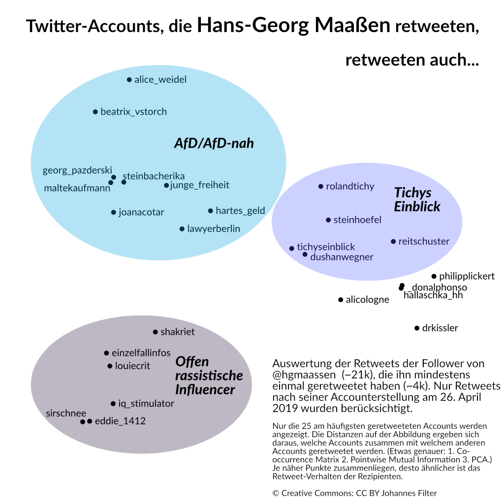

# hgmaassen-retweets

If people are retweeting [@hgmaassen](https://twitter.com/hgmaassen), who are they retweeting besides him? An analysis. [Read the article](https://netzpolitik.org/2019/datenanalyse-maassens-follower-retweeten-rechtsradikale-accounts-aber-fast-nie-die-cdu/) (in German).

  

## Background

We construct an embedding for Twitter acounts to visualize clusters. We apply techniques normaly used to construct [Word Embeddings](https://www.google.com/search?q=word+embeddings&source=lnms&tbm=isch). As far as we know, we are the first ones to use the method like this.

Method:

1. iterate over all accounts and count [co-occurrences](https://en.wikipedia.org/wiki/Co-occurrence) (in the sense: who are they retweeting besides @hgmaassen as a binary choice, count them pair-wise in a 2D matrix)
2. [Pointwise Mutual Information](https://en.wikipedia.org/wiki/Pointwise_mutual_information) to normalize counts and construct a vector space
3. choose N accounts, i.e. the ones with the highest total count, and apply [PCA](https://en.wikipedia.org/wiki/Principal_component_analysis) to project them onto a 2D plane for visualization

This will result into an image where points that are closer together have a similar retweet behaviour of its recipients.

See [2_create_vis.ipynb](2_create_vis.ipynb) for more details.

Some reference if you want to dig deeper in the (NLP) topic: ["Improving Distributional Similarity with Lessons Learned from Word Embeddings"](https://aclweb.org/anthology/papers/Q/Q15/Q15-1016/) by Omer Levy, Yoav Goldberg, Ido Dagan, TACL 2015.

I am not sure wheter I should write/experiment more on the method. If you have an opinion on it, write me an [email](mailto:hi@jfilter.de).

## License

MIT.
